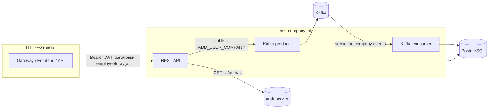

# cms-company-info

Сервис управления структурой компании: компании, сотрудники, департаменты, приглашения и связанная интеграция с auth-service и Kafka.

## Стек

- Node.js + Express
- PostgreSQL (`pg`)
- Kafka (`kafkajs`)
- Swagger UI (`/api-docs`)

## Основные возможности

- Получение компании текущего пользователя и companyId по userId.
- Управление департаментами (создание, обновление, удаление, список, назначение руководителя).
- Управление членством сотрудников в департаментах и перевод между департаментами.
- Получение employeeId по токену и служебные запросы по руководителям.
- Отправка приглашений в компанию с валидацией пользователя через auth-service.
- Чтение и отправка Kafka-сообщений для синхронизации с другими сервисами.

## Взаимодействие с другими сервисами

cms-company-info не живёт изолированно: помимо локальной базы данных он опирается на **auth-service**, **Kafka** и на **HTTP-клиентов** (шлюз, фронт, другие бэкенды).

### Схема потоков



### Кратко по сторонним системам

| Система | Направление | Что делает сервис |
| -------- | ----------- | ----------------- |
| **HTTP-клиенты** | Входящие запросы | Вызывают REST API с `Authorization: Bearer …` и при необходимости передают `employeeid` / `x-employee-id`, `companyid` и т.д.; часть операций ограничена ролью `EXECUTIVE` в данных компании. |
| **auth-service** | Исходящие вызовы | Поиск пользователя по email при приглашении (`/auth/email-exists`), профили сотрудников для списка компании (`/auth/employee/...`), ФИО для отображения руководителей департаментов (`/api/internal/users/...`). Bearer с клиента пробрасывается туда, где это заложено в коде. |
| **Kafka (топик company)** | Входящие сообщения | Consumer подписан на `KAFKA_COMPANY_TOPIC`; обрабатывает событие `CREATED` и синхронно создаёт компанию и сотрудника в БД (ожидается, что сообщения в топик кладёт другой сервис домена «компания»). |
| **Kafka (топик auth)** | Исходящие сообщения | Producer публикует в `KAFKA_AUTH_TOPIC` событие `ADD_USER_COMPANY` после успешного `POST /invitations/send`; читает и реагирует на него **другой** сервис (например auth или оркестратор прав доступа — в этом репозитории только формат отправки). |
| **PostgreSQL** | Локальное хранилище | Не отдельный микросервис, но внешний процесс: все изменения домена компании/сотрудников/департаментов/приглашений сохраняются здесь. |

Детали HTTP-контрактов с auth см. ниже в разделе «Интеграция с auth-service». Детали топиков, групп консьюмера и форматов сообщений см. в разделе «Kafka».

## Быстрый старт

### 1) Установка

```bash
npm install
```

### 2) Настройка окружения

Скопируйте `.env.example` в `.env` и заполните значения.

Минимально важные переменные:

- `PORT` — порт HTTP-сервиса.
- `POSTGRES_HOST`, `POSTGRES_PORT`, `POSTGRES_DB`, `POSTGRES_USER`, `POSTGRES_PASSWORD` — параметры БД.
- `AUTH_SERVICE_URL` — base URL auth-service.
- `JWT_PUBLIC_KEY` или `JWT_PUBLIC_KEY_PATH` — публичный ключ для проверки JWT (RS256).
- `KAFKA_BROKERS`, `KAFKA_CLIENT_ID`, `KAFKA_GROUP_ID`, `KAFKA_COMPANY_TOPIC`, `KAFKA_AUTH_TOPIC` — Kafka-конфигурация.

### 3) Поднять PostgreSQL (опционально через Docker)

```bash
docker compose up -d db
```

По умолчанию в `docker-compose.yml` контейнер Postgres публикуется на `5433`.

### 4) Инициализировать БД

```bash
npm run db:init
```

Скрипт создаст базу при необходимости и применит `db/schema.sql`.

### 5) Запуск сервиса

Для разработки:

```bash
npm run dev
```

Для обычного запуска:

```bash
npm start
```

## Скрипты npm

- `npm start` — запуск сервиса.
- `npm run dev` — запуск с `nodemon`.
- `npm run db:init` — создать БД и применить схему.
- `npm run db:migrate-uuid` — применить миграцию `db/migrate_legacy_text_to_uuid.sql`.

## API

Документация OpenAPI:

- Swagger UI: `GET /api-docs`
- JSON спецификация: `GET /openapi.json`

### Основные эндпоинты

#### Company

- `GET /company` — получить текущую компанию (по `authContext`).
- `PATCH /company` — обновить название компании.
- `DELETE /company` — удалить компанию.
- `GET /company/id/:userId` — получить `companyId` по `userId`.

#### Companies (вложенные ресурсы)

- `GET /companies/:companyId/departments` — список департаментов компании.
- `POST /companies/:companyId/departments` — создать департамент.
- `PATCH /companies/:companyId/departments/:departmentId` — обновить департамент.
- `DELETE /companies/:companyId/departments/:departmentId` — удалить департамент.
- `POST /companies/:companyId/departments/:departmentId/members` — добавить сотрудника в департамент.
- `DELETE /companies/:companyId/departments/:departmentId/members/:employeeId` — убрать сотрудника из департамента.
- `GET /companies/:companyId/employees` — список сотрудников компании (с обогащением данными auth-service).

#### Departments (root)

- `POST /departments` — создать департамент (companyId в body).
- `PATCH /departments/:id` — обновить департамент.
- `DELETE /departments/:id` — удалить департамент.
- `GET /departments/:id` — получить департамент по id вместе со списком сотрудников (`employeeId`, `userId`, `firstName`, `lastName`).
- `POST /departments/transfer` — перевод сотрудника между департаментами.
- `POST /departments/:departmentId/manager` — назначить manager по employeeId.
- `POST /departments/:departmentId/supervisor` — назначить supervisor.

#### Employee

- `GET /employee/id` — получить employeeId текущего пользователя.
- `GET /employee/department-manager` — получить руководителя департамента сотрудника.
- `GET /employee/department-manager-subordinates` — получить userId подчиненных для head supervisor.

#### Invitations

- `POST /invitations/send` — отправить приглашение в компанию и опубликовать Kafka-событие.

## Аутентификация и доступ

- `authContextMiddleware` извлекает `userId` из Bearer JWT (RS256).
- Проверяются поля токена (`alg`, `exp`, `nbf`) и подпись публичным ключом.
- В `authContext` также передается `employeeId` из заголовков (`employeeid` / `employeid` / `x-employee-id`).
- Для внутренних trusted-вызовов поддержан fallback по заголовкам `x-user-id` / `x-userid` / `userid`.
- Ограничения ролей: чувствительные операции доступны только роли `EXECUTIVE`.

## Интеграция с auth-service

Сервис обращается к `AUTH_SERVICE_URL`:

- `GET /auth/email-exists?email=...` — поиск пользователя по email (при отправке приглашения).
- `GET /auth/employee/:userId` — получение данных сотрудника для списка employees.
- `GET /api/internal/users/:userId` — получение ФИО для отображения supervisor в департаментах.

Для внешних запросов используется таймаут 8 секунд.

## Kafka

### Что сервис читает

Consumer запускается при старте приложения:

- Топик: `KAFKA_COMPANY_TOPIC` (пример в `.env.example`: `company`)
- Группа: `KAFKA_GROUP_ID`
- Client ID: `KAFKA_CLIENT_ID`

Ожидаемый входящий формат (JSON):

```json
{
  "event": "CREATED",
  "name": "Company name",
  "userId": "user-uuid-or-id",
  "role": "EXECUTIVE"
}
```

При событии `CREATED` сервис создает компанию и сотрудника, если такой связки еще нет.

### Что сервис пишет

При успешном `POST /invitations/send` публикуется событие:

- Топик: `KAFKA_AUTH_TOPIC` (пример в `.env.example`: `auth_topic`)
- Формат `messages[].value`: JSON-строка

Payload:

```json
{
  "type": "ADD_USER_COMPANY",
  "userId": "2b0d7b2a-8f7f-43ec-a9d4-6fca5c1f33b1",
  "companyId": "db8b7f08-a6c0-4f2f-98b6-9d8b3a7f9b6c"
}
```

Поля:

- `type` (`string`) — всегда `ADD_USER_COMPANY`.
- `userId` (`string`) — ID приглашенного пользователя.
- `companyId` (`string`) — ID компании.

## База данных

Схема в `db/schema.sql` содержит таблицы:

- `company` — компании.
- `employee` — сотрудники компании и их роль.
- `department` — департаменты и их manager.
- `department_employee` — связь many-to-many между департаментами и сотрудниками.
- `invitation` — приглашения в компанию/департамент.

Миграция `db/migrate_legacy_text_to_uuid.sql` нужна, если исторически `company.id` был типа `TEXT`.

## Структура проекта

- `src/app.js`, `src/index.js` — настройка Express и запуск приложения.
- `src/routes` — HTTP-маршруты.
- `src/controllers` — контроллеры.
- `src/services` — бизнес-логика.
- `src/repositories` — SQL-запросы и доступ к данным.
- `src/middlewares` — auth/access middlewares.
- `src/clients` — клиенты внешних сервисов.
- `src/kafka` — producer/consumer Kafka.
- `src/docs/openapi.json` — OpenAPI-спецификация.
- `db` — SQL-схема и миграции.
- `scripts` — служебные скрипты БД.

## Ошибки и коды ответа

Используются прикладные ошибки:

- `BadRequestError` → `400`
- `UnauthorizedError` → `401`
- `ForbiddenError` → `403`
- `NotFoundError` → `404`

Необработанные ошибки возвращаются как `500 Internal server error`.
